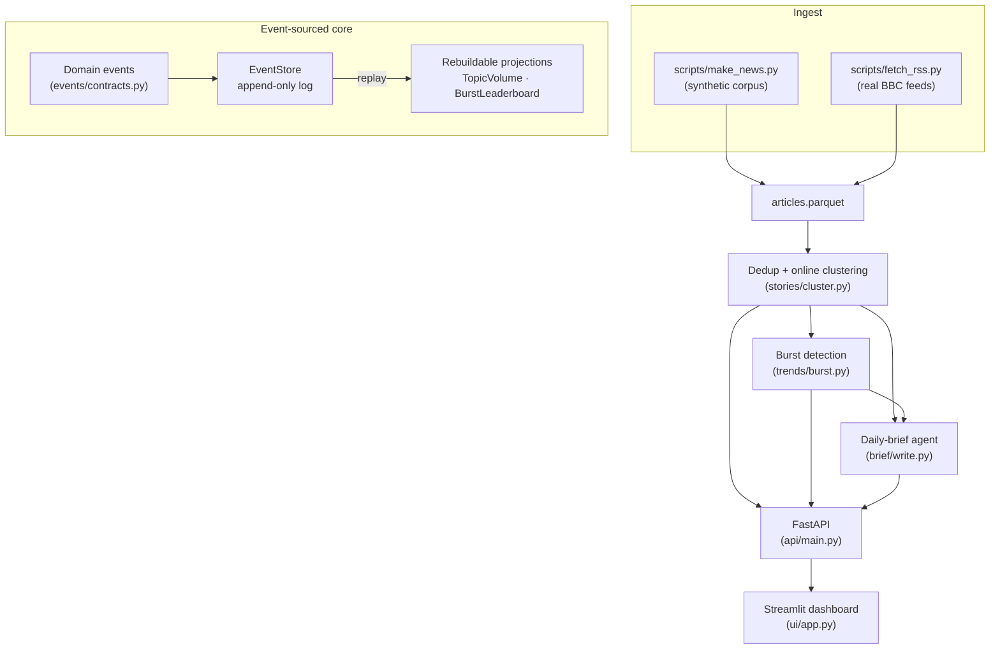
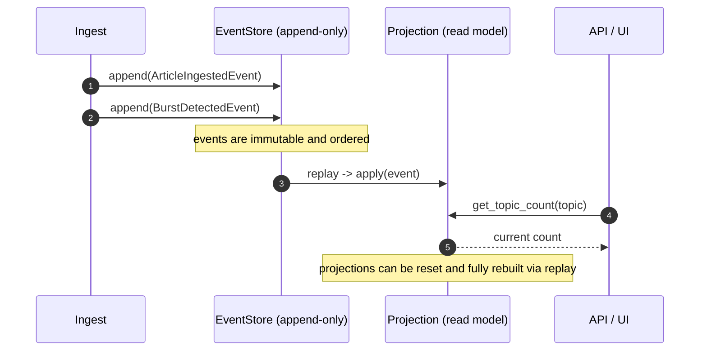

<div align="center">


</div>

# TrendScout — News Intelligence on an Event-Sourced Core

**Turn a firehose of news articles into a short, cited daily brief — and keep the full history of how each story broke.** TrendScout ingests articles, collapses syndicated near-duplicates, clusters the rest into evolving stories, flags topics that are bursting, and writes a grounded executive brief. Every meaningful change is recorded as an immutable domain event in an append-only store, so analytical read models can be wiped and rebuilt from scratch by replaying history.

<div align="center">

[](https://www.python.org/)
[](https://fastapi.tiangolo.com/)
[](https://pytest.org/)
[](https://opensource.org/licenses/MIT)

</div>

---

## The problem

News moves fast, and most of what arrives is redundant: the same wire story republished by a dozen outlets. An analyst doesn't want a thousand headlines — they want *which stories are real*, *which are accelerating right now*, and *a short summary they can trust*. And when you later change a clustering threshold or a burst formula, you want to re-derive those views over the same history, not lose it.

TrendScout answers both needs. The NLP pipeline does the reading; an **event-sourced core** keeps the audit trail so analytical views are reproducible and disposable.

## What it does

- **Deduplicate** — collapses near-identical syndicated articles into the earliest copy.
- **Cluster** — groups the survivors into stories by semantic similarity, online (one pass).
- **Detect bursts** — flags topics whose volume today spikes above their trailing baseline.
- **Write a brief** — an LLM agent summarises the top stories into a cited daily digest.
- **Record everything** — each ingestion, cluster, burst, and brief becomes an immutable event.

## How it works

Two layers cooperate. The **serving pipeline** (dedup → cluster → burst → brief) computes analytics on demand and is exposed over a small REST API. The **event-sourced core** records domain events in an append-only log and hydrates rebuildable read-model projections from them.



### The Event Sourcing pattern

State is treated as a sequence of immutable, ordered facts rather than mutable rows:



- **Domain events** (`events/contracts.py`) — frozen dataclasses: `ArticleIngestedEvent`, `StoryClusterFormedEvent`, `BurstDetectedEvent`, `TrendBriefGeneratedEvent`.
- **Event store** (`events/store.py`) — an in-memory append-only log with sequential indexing and type-filtered `read_stream`.
- **Projections** (`projections/projections.py`) — `TopicVolumeProjection` and `BurstLeaderboardProjection` implement `apply` / `reset`, and inherit `rebuild_from_store`, which clears state and replays every event. A read model can be discarded and reconstructed at any time, and new projections can be added without touching ingestion.

## Methodology

### Near-duplicate collapse and story clustering

Titles are embedded with `sentence-transformers/all-MiniLM-L6-v2` (via `fastembed`) and L2-normalised, so cosine similarity is a dot product. Articles are processed in publication order:

- **Dedup** — if a new article's cosine similarity to any already-seen article is `>= dedup.similarity_threshold` (default `0.92`), it is folded into that earliest copy.
- **Clustering** — otherwise it joins the story whose running centroid is closest, if that similarity is `>= stories.cluster_threshold` (default `0.72`); else it starts a new story. Centroids update incrementally, so the same greedy algorithm serves both batch and streaming ingestion.

This is deliberately a single-pass, order-dependent method — fast and incremental, at the cost of order sensitivity.

### Burst detection

For each topic, compare today's article count against the mean of the preceding `burst_trailing_days` (default `5`). A burst fires when volume is both meaningful and accelerating:

$$\text{today} \geq \text{min\_articles} \quad\text{and}\quad \text{today} \geq \theta \cdot \mu_{\text{trailing}}$$

with `burst_min_articles = 4` and ratio `θ = burst_ratio = 2.5` by default. Topics with no prior history also qualify once they clear the minimum-volume floor.

### Daily-brief agent

`brief/write.py` selects the top `brief.top_stories` (default `5`) clusters, formats them with per-story source counts, and prompts an LLM to write a terse brief that **cites each item and is instructed never to invent facts or numbers**. The provider is pluggable via `llm/factory.py`: `ollama` (default), `claude` (Anthropic), or `fake` (deterministic, for tests and offline runs).

## Getting started

```bash
uv sync --group dev                     # install (or: make install)

uv run python scripts/make_news.py      # generate the synthetic corpus -> data/articles.parquet
# or: uv run python scripts/fetch_rss.py to pull real BBC RSS headlines

make api                                # FastAPI on http://localhost:8100
make ui                                 # Streamlit dashboard on http://localhost:8601
```

The API and UI need `data/articles.parquet` to exist first; the `/stories`, `/trends`, and `/brief` endpoints return `503` until a corpus has been generated. The brief agent defaults to a local `ollama` provider — set `LLM_PROVIDER=fake` for a no-dependency run, or `LLM_PROVIDER=claude` with `ANTHROPIC_API_KEY` for Anthropic.

Optional experiment tracking:

```bash
make mlflow                             # MLflow UI on http://localhost:5010
```

Or with Docker:

```bash
make docker-up                          # docker compose up --build -d
make docker-down
```

## API

The FastAPI app is `trendscout.api.main:app`. The pipeline runs on demand and is cached per process.

| Method | Route | Purpose |
|---|---|---|
| `GET` | `/health` | Liveness check + active LLM provider |
| `GET` | `/stories` | Story clusters, largest first (headline, article/source counts, velocity) |
| `GET` | `/trends` | Detected bursts plus article and near-duplicate totals |
| `POST` | `/brief` | Generate a cited daily brief; optional `{"provider": "ollama\|claude\|fake"}` |

## Evaluation

The synthetic corpus from `scripts/make_news.py` embeds ground truth — planted story ids, known duplicate pairs, and a deliberate burst on a specific topic and day — so dedup, clustering, and burst detection are all measurable rather than eyeballed. The test suite exercises each against that ground truth (duplicates are folded, same-story articles cluster together, the planted burst is detected and the minimum-volume floor is respected). No accuracy figures are quoted here because they depend on the generated dataset and seed; reproduce them with:

```bash
uv run python scripts/make_news.py
uv run pytest -q
```

Example output shape (illustrative, on synthetic data — not a benchmark):

```json
{
  "bursts": [{"key": "technology", "today": 11, "trailing_mean": 3.2, "ratio": 3.44, "day": "2026-08-29"}],
  "n_articles": 240,
  "n_near_duplicates": 38
}
```

## Testing

```bash
make test          # uv run pytest --cov
```

- `test_pipeline.py` — dedup folding, clustering, story velocity/source counts, burst logic
- `test_event_sourcing.py` — event store append/read and projection rebuild-by-replay
- `test_api_brief.py` — HTTP contract for `/health`, `/stories`, `/trends`, `/brief`

## Limitations

- Clustering is single-pass and order-dependent; reordering the input can change story boundaries.
- Dedup and clustering compare each article against seen items with a linear scan — fine for a demo corpus, not tuned for very large streams.
- Thresholds (`0.92` dedup, `0.72` cluster, `2.5×` burst) are calibrated for the synthetic data and would need recalibration on real feeds.
- The event store is in-memory and non-durable; it demonstrates the pattern rather than providing a persistent log.
- Brief quality depends on the chosen LLM provider; the `fake` provider is deterministic and for testing only.

## Project structure

```
src/trendscout/
├── events/        # Event Sourcing: immutable domain events + append-only store
├── projections/   # Rebuildable read models (topic volume, burst leaderboard)
├── stories/       # Embedding dedup + online story clustering
├── trends/        # Statistical burst detection
├── brief/         # Cited daily-brief LLM agent
├── llm/           # Pluggable providers (ollama | claude | fake)
├── api/           # FastAPI app (main:app) and routes
└── ui/            # Streamlit dashboard
scripts/           # make_news.py (synthetic corpus), fetch_rss.py (real feeds)
configs/           # Thresholds and pipeline parameters (config.yaml)
```

## License

MIT

---

<div align="center">

**Jackson Marcus** · Senior AI & Machine Learning Engineer

[](https://github.com/jackson-marcus)
[](mailto:wajahatanees41@gmail.com)

</div>
